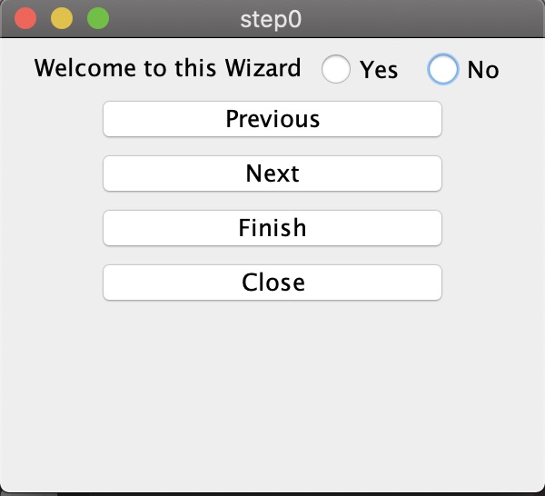

# 1. Java通过链表实现导航功能

## 1.1. 使用说明

在创建一个MainWindowsClass对象后，只需要调用该实例的windowsClass.insert("这是第1页",step++);方法就可以实现后续页面的插入。

- 点击Previous按钮可以跳转到上一个页面
- 点击Next按钮可以跳转到下一个页面
- 点击Finish按钮可以显示之前页面的答案

- 点击Close就结束整个程序

## 1.2. 详细介绍

以下是真个程序的uml图

MainWindowsClass对象是整个导航的起始页面

在创建一个MainWindowsClass对象后，只需要调用该实例的windowsClass.insert("这是第1页",step++);方法就可以实现后续页面的插入。

在MainWindowsClass中实现了一个双向链表，每个节点就是一个页面，页面之间的跳转就是节点的前后搜索。

在第一页的Previous 和 最后一页的Next键上做了限制，按键会变灰，点击不会有具体的操作。

对于Finish使用了Singleton设计模式，在一个页面中显示一个finish的结果。